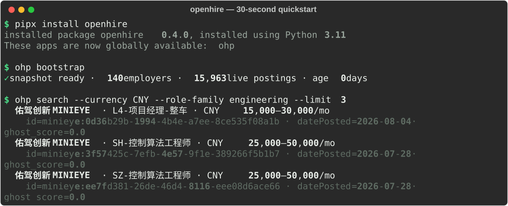

<!-- mcp-name: io.github.gzchenhao/openhire -->

# openhire-mcp

> **Jobs come to you. Your résumé never passes through OpenHire's servers, and we never store it.**
> 岗位来找你，简历不经过我们的服务器，也不被我们存储。

    

<p align="center"></p>
<p align="center"><sub>Real terminal output — install from PyPI, download the public index, search. No account, no signup.</sub></p>

An MCP server that turns your AI assistant (Claude, Cursor, Windsurf) into a private radar
for **AI / Infra, autonomous-driving and embodied-AI roles** — sourced directly from ~120
company career sites and their public ATS APIs (Greenhouse / Lever / Ashby / 北森 Beisen),
in the US, Europe **and China**. **No account. No signup. No résumé upload. Ever.**

Matching runs on your machine; only an anonymous fingerprint and hard filters ever reach the
server. This is the 「哨兵 / Sentinel」 reference implementation — see
`design_handoff_openhire_v01/README.md` for the full protocol spec.

---

## Quickstart — under a minute

```bash
# 1. Install (pipx keeps it isolated and puts `ohp` on your PATH)
pipx install openhire

# 2. Get a job index. Default: download the public snapshot, then refresh it live.
ohp bootstrap
#   --fresh      crawl the public ATS from scratch (heuristic, free, no snapshot)
#   --deepseek   higher-quality extraction using YOUR OWN DEEPSEEK_API_KEY

# 3. Use it directly…
ohp search --required-skills rust,k8s --remote --role-family engineering

# …or connect it to an MCP client:
ohp serve
```

Then point your MCP client at it — see **[Works with](#works-with)** below.

---

## Works with

All clients use the same MCP entry. If you ran `pipx install openhire`, use `ohp`; otherwise
`uvx openhire serve` fetches and runs it with no prior install (needs [uv](https://docs.astral.sh/uv/)).

**Claude Desktop** — `%APPDATA%\Claude\claude_desktop_config.json` (macOS: `~/Library/Application Support/Claude/`); quit & reopen after editing:
```json
{ "mcpServers": { "openhire": { "command": "ohp", "args": ["serve"] } } }
```

**Cursor** — `~/.cursor/mcp.json` (or a project `.cursor/mcp.json`):
```json
{ "mcpServers": { "openhire": { "command": "uvx", "args": ["openhire", "serve"] } } }
```

**Windsurf** — `~/.codeium/windsurf/mcp_config.json`:
```json
{ "mcpServers": { "openhire": { "command": "uvx", "args": ["openhire", "serve"] } } }
```

> Run `ohp bootstrap` once first so the index has data. On Windows Claude Desktop from the
> Microsoft Store, the config is under `…\Packages\<Claude package>\LocalCache\Roaming\Claude\`.

---

## What it does

| Tool | What it gives you |
|------|-------------------|
| `search_jobs` | Hard-filter the live index; every result carries `verified_at`, `datePosted`, `days_open`, `ghost_score`, `remote_scope`, `eligible_regions`, `apply_channel`. Filter by `required_skills` (AND), `role_family`, `remote_scope`, `min_salary` + `currency`. |
| `watch_intent` | Register a standing intent once — new matching jobs are waiting next time you check, even after you close the terminal. Accepts `required_skills` / `role_family` so sales / solutions roles stay out. |
| `check_watches` | Pull the matches that are new since your last check (client-pull; stdio has no push). |
| `authorize_application` | One explicit confirmation per job. It records your authorization and returns the employer's **own** application URL — you apply as yourself. It **cannot** accept a résumé. |
| `get_company_info` | Aggregate, anonymous trust signals for one employer (`ghost_score_avg`, `active_jobs`, `index_built_at`). Never any candidate data. |

Optional, entirely local: `ohp init --scan <dir>` derives a **skill fingerprint** from your
own repos. You never write a résumé; the code never leaves your machine — only an anonymous
vector does.

## The five protocol fields

Every listing is valid `schema.org/JobPosting`, plus:

- `verified_at` — last moment confirmed live on the employer's own site
- `source` — `employer_site | ats_public_api` (never a job board)
- `ghost_score` — 0–1 listing-activity signal, aged off the **real** posting date (lower =
  fresher). A noise filter, not an accusation: long-open listings are often evergreen talent
  pools or slow pipelines — the score simply lets agents down-rank low-activity noise
- `response_sla_days` — employer's committed response window (v0.1: always null)
- `apply_channel` — always the employer's own application URL, deep-linked to the specific job

## Privacy model

| | |
|---|---|
| **Résumé / PII upload** | **never** — matching runs locally; a résumé never transits the server, and we never store one |
| **What the server sees** | one anonymous, client-generated fingerprint + hard filters |
| **Repo scan** | local-only · personal projects · explicit consent · opt-out anytime |
| **Job sources** | first-party only: employer career pages + public ATS APIs (Greenhouse / Lever / Ashby) |

## First-run data — the snapshot vs. fresh

`ohp bootstrap` (default) downloads a small **public** index snapshot (a GitHub Release
asset — `companies` + `jobs` only, **zero** user data) and then runs one incremental crawl to
refresh `verified_at` / delisting. `--fresh` skips the snapshot and crawls the public ATS from
scratch with the free offline heuristic extractor. Either way: no account, no PII.

## Three rules this project will never break

1. Your résumé stays on your machine — it never transits the server, and we never store it.
2. Ranking is not for sale — it is only `f(match_quality, freshness)`, a locked pure function.
3. Employers pay only for authorized, delivered outcomes — never for exposure. (v0.1 has no
   billing at all.)

These are enforced by CI (`tests/test_privacy.py`, `tests/test_ranking.py`,
`tests/test_snapshot.py`).

## Development

```bash
python -m venv .venv && . .venv/Scripts/activate   # Windows
pip install -e ".[dev]"
pytest        # privacy red lines + ranking + snapshot must be green
```

Set `OPENHIRE_DATABASE_URL=postgresql+psycopg://…` to run against Postgres instead of the
default local SQLite file (`~/.openhire/openhire.db`).

## Roadmap

- **v0.2** — CN ATS adapters (Beisen shipped; Moka next) · `ghost_score` public beta
- **v0.3** — Employer claim + verified badges — employers can [reserve their claim
  today](https://github.com/gzchenhao/openhire/issues/new?template=employer_claim.yml) via a
  corporate-identity GitHub issue (zero-cost now; badges + listing-status control ship with
  v0.3) · response-SLA enforcement (7-day auto-delist) · **redacted proof-of-fit** — an
  anonymous, candidate-authorized match summary that travels with an application (skills
  overlap only; identity never included, résumés still never transit the server)
- **v1.0** — Open, vendor-neutral schema extension for AI-readable job postings

## FAQ

**Where does the job data come from?**
Directly from ~120 employers' own public ATS APIs (Greenhouse, Lever, Ashby, 北森 Beisen) — the same
endpoints that power their careers pages. No scraping, no third-party job boards. `source` is
always `ats_public_api`, and `verified_at` records the last time we confirmed each posting live.

**Why should I trust `ghost_score`?**
It's a pure, open, unpurchasable function — `min(1, 0.15·relist_count + staleness)` aged off the
**real** ATS posting date, not our crawl date. The formula lives in `pipeline/ghost_score.py`,
is unit-tested, and takes no money as input (red line #2). Long-open, repeatedly-relisted
postings score higher; you can always re-rank client-side. Read it as **signal-to-noise, not
bad faith**: plenty of high-scoring listings are legitimate evergreen talent pools. Employers
who want their listing activity represented accurately can claim their tenant (see Roadmap).

**Does my résumé actually go through the server — really?**
No. There is no résumé anywhere in the protocol. `authorize_application` has no résumé/file
parameter (it structurally cannot accept one), matching runs on your machine, and the only thing
that ever transits the server is a short anonymous fingerprint like `#a3f9`. This is enforced by
`tests/test_privacy.py`, and the published snapshot carries **zero** user data (`tests/test_snapshot.py`).

**Does it support China (中国区)?**
Yes, since **v0.2**: employers on **北森 Beisen** (`<tenant>.zhiye.com`) are indexed — currently
11 robotics / embodied-AI companies (宇树 Unitree, 优必选 UBTECH, 星海图 Galaxea, 越疆 Dobot,
梅卡曼德 Mech-Mind, 普渡 Pudu, 海柔创新, 新松 SIASUN …). Pay published as 月薪 keeps its real
period (`salary_period`), so a salary floor no longer silently drops Chinese roles.

**飞书招聘 (Feishu Hire) is not supported and won't be**: it signs its job-list requests with a
ByteDance `_signature` and gates them behind a captcha SDK, so its listings are not publicly
readable. We don't break anti-bot measures. Moka is on the roadmap.

**How do I get a company added?**
Open a **Company inclusion request** issue (title it with the company + its ATS URL) — this is
the best way to contribute. If you code, add it to `src/openhire/seed/candidates.py` (company
slug + ATS vendor/tenant) and open a PR; the seeder validates tenants against the live API.

## License

MIT © OpenHire Protocol · PRs welcome.

---

*Built by a non-coder PM-ing Claude Code — full acceptance reports in [`reports/`](reports/).*
